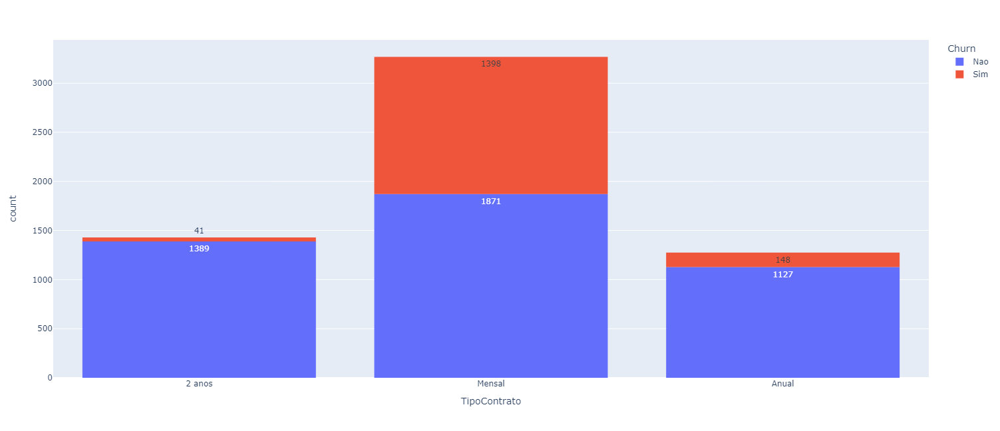
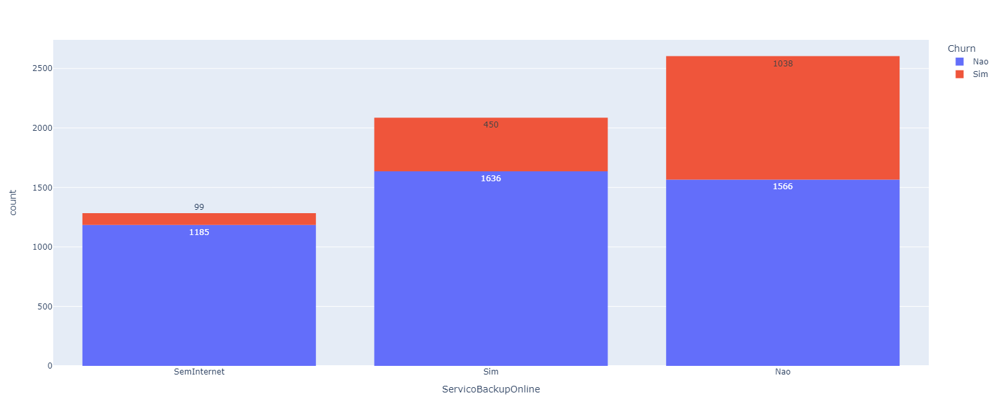
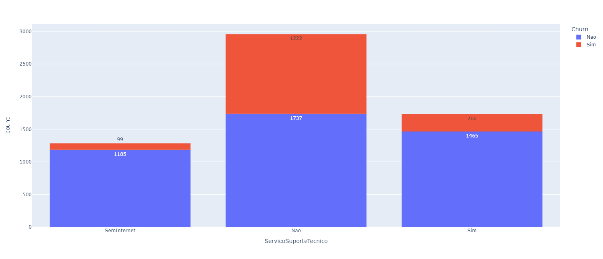
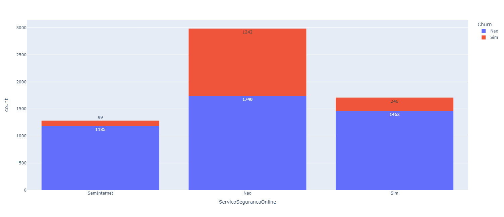
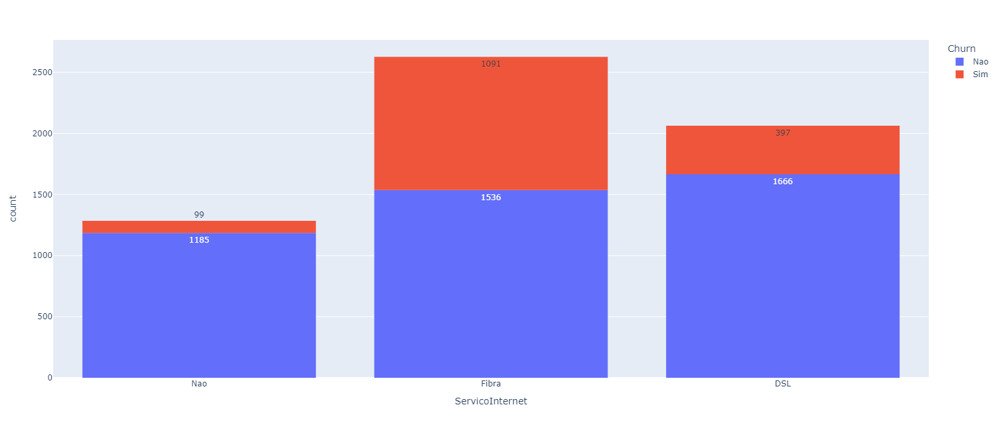

<h1> Análise_de_dados-Projeto_Basico-1</h1>

<h3>🔭&nbsp;Apresentação do problema:</h3>

A empresa de telecom para a qual você trabalha reparou uma baixa no número de assinantes de seus serviços nos últimos meses
e pediu para que o analista tentasse descobrir a porcentagem dessas baixas (Churn), o porquê de está havendo essas baixas e sugestões
de soluções
  

 Para que o mesmo resolva o problema foi disponibilizado a base de dados telecom_users.csv.

<h3>🧭&nbsp;Passos para a resolução:</h3>

- [ ] Passo 1: Importar base de dados
- [ ] Passo 2: Visualizar a base de dados
    - Entender as informações na base de dados 
    - Descobrir os problemas na base de dados, como ausencia de informação
- [ ] Passo 3: Tratar os dados
- [ ] Passo 4: Analise Inicial (entender como estão os cancelamentos)
- [ ] Passo 5: Analise Completa (entender o motivo dos cancelamentos)

<h3>🛠&nbsp;Tecnologias utilizadas:</h3>

- Programação em linguagem python
   - Bibliotecas: Pandas, Plotly
- VsCode

<h3>📝&nbsp;Resolução:</h3>

- [x] Passo 1 - Manipulação de arquivo .csv. 
- [x] Passo 2 - Inspecão preliminar da base de dados.
- [x] Passo 3 - Eliminção de colunas e linhas vazias ou que não tenham dados relevantes e possível alteração do tipo de dados se necessário.
- [x] Passo 4 - Aferição da taxa de assinantes que desistiram do serviços prestados pela empresa.
    - Taxa de 26% de desistência.
- [x] Passo 5 - Produção de gráficos e inferências a partir deles.

 
 <h3>Tipo de Contrato X Desistência:</h3>
 
Análise: Quase todos os cancelamentos estão na forma de pagamento mensal. 
  Sugestão: Tornar as outras formas de planos mais atrativas.

  
 

				
	

 <h3>Meses como cliente X Desistência:</h3>
 
Análise: A chance do cliente cancelar nos primeiros meses é mt alta. 
  &emsp;&emsp;&emsp; &nbsp; Isso pode significar que a primeira experiência do cliente não está legal 
  Sugestão: Descontos e promoções nos meses iniciais.

  
 

				
	

 
 <h3>Serviços X Desistência:</h3>
  
Análise: Quanto mais serviços o cliente tem menor chance dele cancelar. 
  Sugestão: Oferecer serviços de bônus ou com desconto para que consuma mais serviços.

  
 

				
				
				
	

 
 <h3>Serviço de Internet X Desistência:</h3>
  
Análise: Há algum problema no serviço de fibra, a taxa de cancelamento está muito alta. 
  Sugestão: Fornecer ao analista acesso aos dados de reparo para que uma análise mais profunda nesse caso seja 
  &emsp;&emsp;&emsp;&emsp; &nbsp; feita ou conversar com o setor tecnico responsavel para entender o problema.

  
 

				
	

 
 <h3>Observação:</h3>
 Outros gráficos não foram usados por seus indicadores não apresentarem expressão
 significativa de desistência.  
Contudo os gráficos se encontram na pasta chamada 
Histogramas no projeto.
 
 
<!--
Conclusões:
- A chance do cliente cancelar nos primeiros meses é mt alta
    - Isso pode significar que a primeira experiência do cliente não está legal
    - Talvez seja uma boa ideia fazer ou promoções

- Clientes com famílias maiores tendem a cancelar menos
    - Oferecer segunda uma linha de graça ou com desconto

- Quase todos os cancelamentos estão na forma de pagamento mensal
    - Tornar mais os planos atrativos

- Boleto tem muitos cancelamentos
    - dar desconto nas outras formas de pagamento
-->
